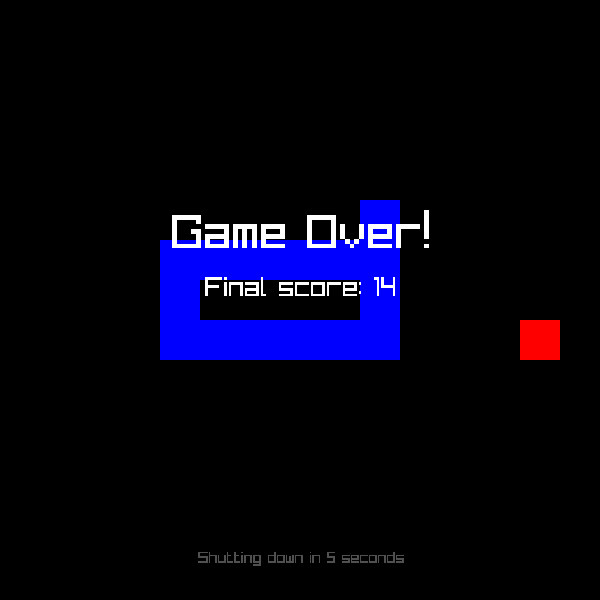

# Snake

A simple snake game written in Rust using Raylib.

Code for the [How To Use Raylib in Rust With Your Own Bindings](https://rabzelj.com/blog/rust-zig-raylib-ffi-custom-bindings) blog post.



## Run

```bash
$ just run
```
